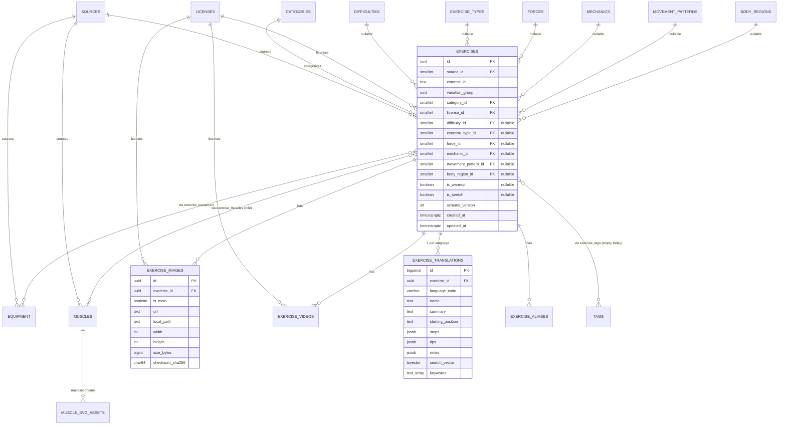

# Database design

The PostgreSQL schema is the REPS backend's system of record. It is generated
from `db/migrations/*.sql` (never hand-edited — see `db/schema.sql`'s header)
and seeded from the pipeline's JSON exports by `db/seed.py`.

## ER diagram

## Why this shape

- **Every entity has a stable id, timestamps, and participates in schema
  versioning.** `exercises.id`/`exercise_images.id`/`exercise_videos.id` reuse
  the uuid already assigned upstream (by wger, or generated by the pipeline
  for custom providers) rather than minting a new surrogate key — the JSON
  export, Postgres, and the SQLite offline cache all refer to the exact same
  identity for the same row.
- **Taxonomy tables that no current provider populates still exist**: `tags`,
  `body_regions`, `movement_patterns`, `difficulties`, `exercise_types`,
  `forces`, `mechanics`. Every FK to them on `exercises` is nullable and is
  `NULL` today — never backfilled with invented data. This is what "the
  schema never needs redesigning" means concretely: when ExerciseDB (which
  has `bodyPart`/`target`/`difficulty`-shaped fields) is wired in, it writes
  into these same columns instead of triggering a migration.
- **`(source_id, external_id)` uniqueness** on `equipment`/`muscles`/
  `exercises` is how multiple providers coexist without id collisions: wger's
  numeric muscle id `2` and a future ExerciseDB muscle id `2` are different
  rows, correctly scoped by source.
- **Structured descriptions** (`summary`/`starting_position`/`steps` (jsonb
  array)/`tips`/`notes`) mirror the Phase 2 cleaning pipeline's output
  (`clean_dataset.py`) exactly, so no lossy re-flattening happens on the way
  into the database.

## Search (Epic 4) — see `docs/search.md` for the full explanation

`exercise_translations` carries `search_normalized`, `search_vector`
(tsvector, GIN-indexed) and `keywords` (text[], GIN-trigram-indexed),
maintained by a trigger in `db/migrations/0002_search.sql`. Populated by
`pipeline/search_indexer.py`.

## Migrations

| File | Adds |
|---|---|
| `db/migrations/0001_init.sql` | Every core entity from the list above, `schema_migrations` tracking, `updated_at` triggers. |
| `db/migrations/0002_search.sql` | `pg_trgm`/`unaccent` extensions, `normalize_arabic()`/`normalize_latin()`, `search_vector`/`keywords` columns + trigger + indexes. |

Apply with `python db/migrate.py apply`; regenerate `db/schema.sql` (the
frozen, single-file schema dump) with `python db/migrate.py dump-schema`.
Both are idempotent — re-running `apply` against an up-to-date database is a
no-op (verified: see `ENGINEERING_REPORT.md`).

## Seeding

`python db/seed.py` reads `data/output/reps_exercises_clean.json` (Phase 2's
cleaned + translated text) merged with `data/output/reps_exercises.json`
(Epic 1's freshest image/video metadata — the two files are complementary,
see the module docstring in `db/seed.py`), plus
`assets/muscles/muscle_svg_map.json` and `data/output/
svg_validation_report.json`, and upserts every table keyed by a stable id.
Writes `data/output/seed_report.json` with per-table inserted/updated/skipped
counts and any row-level errors (one bad exercise never aborts the whole
seed — see the try/except per exercise in `db/seed.py::seed`).

Verified end-to-end against a disposable Docker Postgres 16 instance: 828
exercises / 2,484 translations / 336 images / 0 videos (disabled by policy
— see `docs/assets.md` → "Videos") / 1,736 muscle links / 710 equipment
links / 95 aliases, zero errors, byte-identical row counts on a second run
(idempotency confirmed).

## SQLite offline export (Android)

`python db/sqlite_export.py` connects to Postgres and fully rebuilds
`data/output/reps_offline.sqlite` — a denormalized-enough, read-only mirror
including an `exercise_fts` FTS5 virtual table so search keeps working with
no network connection. See `docs/android-integration.md`.

**PostgreSQL is always the write path; SQLite is always a cache.** There is
no code path that writes to SQLite except this exporter, and no code path
that reads from SQLite on the server.
